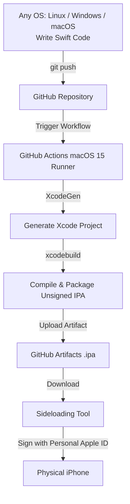

# Cross-Platform Guide: Build iOS Apps with GitHub & Install Free on iPhone

A complete, beginner-friendly guide to building modern Swift iOS apps in the cloud using **GitHub Actions** and installing them on physical iPhones for **free** (no paid Apple Developer account or local Mac required).

---

## Architecture Overview



---

## Prerequisites

- An **iPhone** running iOS 16 or newer.
- A free **Apple ID** (your standard personal Apple account).
- A **GitHub account**.
- A computer running **Linux**, **Windows**, or **macOS**.
- A standard USB cable to connect your iPhone to your computer for the initial install.

---

## Step 1: Push Project to GitHub

1. Clone or navigate into your project repository directory:
   ```bash
   git init
   git add .
   git commit -m "Initial commit: iOS Swift starter app"
   ```

2. Create a new repository on [GitHub](https://github.com/new) (can be Public or Private).
   > **Note on Actions Quota**: Public repositories have **unlimited free GitHub Actions minutes**. Private repositories receive 2,000 free runner minutes/month. Each iOS build takes ~1–2 minutes.

3. Push your code to GitHub:
   ```bash
   git branch -M main
   git remote add origin https://github.com/<your-username>/<your-repo-name>.git
   git push -u origin main
   ```

---

## Step 2: Download the Compiled IPA

1. On GitHub, navigate to the **Actions** tab of your repository.
2. Select the latest workflow run named **"Build iOS App (Unsigned IPA)"**.
3. Once the build finishes (approx. 1.5–2 minutes), scroll down to the **Artifacts** section.
4. Click **`MyiOSApp-unsigned-ipa`** to download the zip file.
5. Extract the downloaded zip file on your computer to get **`MyiOSApp.ipa`**.

---

## Step 3: Install the App on Your iPhone (Choose Your Platform)

Because the IPA is compiled in CI without Apple certificates, a sideloading utility signs it with your free personal Apple ID before installing it on your device.

Click your platform below to expand the instructions:

<details>
<summary><b>Linux (Fedora, Ubuntu, Debian, Arch)</b></summary>

<br>

On Linux, use **[Plume Impactor](https://github.com/declaration/impactor)** (available directly on **[Flathub](https://flathub.org/apps/dev.khcrysalis.PlumeImpactor)**) — a modern, open-source GTK GUI tool that natively supports Apple's AuthKit 2-Factor Authentication (2FA) and free developer signing.

#### 1. Install USB device communication tools:
- **Fedora / RHEL**:
  ```bash
  sudo dnf install -y usbmuxd libimobiledevice libimobiledevice-utils
  ```
- **Ubuntu / Debian**:
  ```bash
  sudo apt update && sudo apt install -y usbmuxd libimobiledevice6 libimobiledevice-utils
  sudo systemctl start usbmuxd
  ```
- **Arch Linux**:
  ```bash
  sudo pacman -S usbmuxd libimobiledevice
  sudo systemctl start usbmuxd
  ```

#### 2. Prevent GNOME/KDE from Locking the iPhone on Boot:
> [!IMPORTANT]
> Desktop environments (like GNOME) run background volume monitors (`gvfs-gphoto2-volume-monitor` and `gvfs-afc-volume-monitor`) that automatically seize the iPhone's USB endpoint and lockdown socket on boot. This triggers `lockdown error -8` or device-busy conflicts and freezes `usbmuxd`.
>
> Run this once to permanently prevent these conflicts:
```bash
# Disable file manager automounting
gsettings set org.gnome.desktop.media-handling automount false
gsettings set org.gnome.desktop.media-handling automount-open false

# Permanently mask GNOME's conflicting monitors
systemctl --user stop gvfs-gphoto2-volume-monitor.service gvfs-afc-volume-monitor.service
systemctl --user mask gvfs-gphoto2-volume-monitor.service gvfs-afc-volume-monitor.service
killall -9 gvfs-gphoto2-volume-monitor gvfs-afc-volume-monitor gvfsd-gphoto2 2>/dev/null || true
```

#### 3. Pair and Trust Your iPhone:
1. Connect your iPhone via USB and unlock the screen.
2. Pair with Linux using the terminal:
   ```bash
   idevicepair pair
   ```
3. A popup saying **"Trust This Computer?"** will appear on your iPhone screen. Tap **Trust** and enter your passcode.
4. Run `idevicepair pair` once more to confirm:
   ```bash
   idevicepair pair
   ```
   *(It will output: `SUCCESS: Paired with device <UDID>`)*.

#### 4. Install Impactor via Flathub (Recommended):
Install **Plume Impactor** directly from Flathub:
```bash
flatpak install -y flathub dev.khcrysalis.PlumeImpactor

# Grant permission to access local filesystem so you can drag-and-drop .ipa files easily:
flatpak override --user --filesystem=host dev.khcrysalis.PlumeImpactor
```

*(Alternative for non-Flatpak systems: download and unpack the AppImage binary from [GitHub Releases](https://github.com/declaration/impactor/releases)).*

#### 5. Install the App using Impactor:
1. Ensure your iPhone is unlocked and connected via USB.
2. Launch **Plume Impactor** from your Applications menu (or run `flatpak run dev.khcrysalis.PlumeImpactor`).
   > **Note**: Always unlock and connect your iPhone **before** opening Impactor so it detects the device on launch.
3. Your connected iPhone will appear in the device selector.
4. Select or drag-and-drop your extracted `MyiOSApp.ipa`.
5. Sign in with your Apple ID and enter the 6-digit 2FA code sent to your device.
6. Click **Install**.

</details>

<details>
<summary><b>Windows</b></summary>

<br>

On Windows, use **[Sideloadly](https://sideloadly.io/)** — a beginner-friendly tool to sign and install apps on your iPhone.

#### 1. Why iTunes & iCloud Are Required on Windows:
Unlike macOS or Linux, Windows has no native drivers for iPhone USB communication, nor libraries to authenticate with Apple's 2FA servers:
- **iTunes** provides Apple's official USB driver (`usbaapl64.sys`), allowing your PC to see and talk to the iPhone.
- **iCloud** provides Apple's authentication libraries (`ApplePushService.dll`), allowing Sideloadly to perform secure 2-Factor Authentication with Apple.

> [!IMPORTANT]
> **Why you CANNOT use the Microsoft Store version**:
> Microsoft Store apps run inside a locked, isolated sandbox. Sideloadly cannot access the drivers or files inside that sandbox. You **must** download and install the direct standalone installers from Apple using the links below:

1. **Download & Install iTunes (64-bit Windows)**: [Direct Apple Download Link](https://www.apple.com/itunes/download/win64)
2. **Download & Install iCloud (Windows)**: [Direct Apple Download Link](https://updates.cdn-apple.com/2020/windows/001-39935-20200911-1A70AA56-F448-11EA-8109-AE43397F938A/iCloudSetup.exe)
*(Restart your computer after installing if prompted).*

#### 2. Install Sideloadly:
1. Download and install **[Sideloadly (64-bit Windows)](https://sideloadly.io/)**.
2. Connect your iPhone to your PC using your USB cable.
3. Unlock your iPhone screen. When prompted with **"Trust This Computer?"**, tap **Trust** and enter your passcode.

#### 3. Sign & Install the App:
1. Open **Sideloadly**. Your connected iPhone will automatically appear in the device dropdown at the top.
2. Drag and drop your extracted **`MyiOSApp.ipa`** into the large app icon box in Sideloadly.
3. Type your personal Apple ID email address into the **Apple ID** field.
4. Click **Start**.
5. When prompted, enter your Apple ID password and the 6-digit 2-Factor Authentication code that appears on your iPhone.
6. Sideloadly will sign the app with your Apple ID and install it directly to your iPhone home screen!

</details>

<details>
<summary><b>macOS</b></summary>

<br>

1. Download and install **[Sideloadly](https://sideloadly.io/)** or **[AltStore](https://altstore.io/)**.
2. Connect your iPhone via USB or enable "Show this iPhone when on Wi-Fi" in Finder.
3. Open Sideloadly, drag and drop `MyiOSApp.ipa`, enter your Apple ID, and click **Start**.

*(Alternative for macOS: You can also use [iOS App Signer](https://dantheman827.github.io/ios-app-signer/) + Apple Configurator / Xcode).*

</details>

<details>
<summary><b>On-Device / Wire-Free (SideStore)</b></summary>

<br>

If you want to install and update apps directly on your iPhone without touching a computer every 7 days:

1. Perform a one-time install of **[SideStore](https://sidestore.io/)** using your computer (via Impactor, Sideloadly, or AltServer).
2. Follow SideStore's on-device setup (installing the WireGuard pairing profile).
3. From then on:
   - Download `MyiOSApp.ipa` directly from GitHub Actions inside **Safari on your iPhone**.
   - Open SideStore, tap `+`, and select the downloaded `.ipa`.
   - SideStore will sign, install, and refresh your apps entirely over local Wi-Fi without needing a PC.

</details>

---

## Step 4: First-Time iOS Device Settings

The first time you launch an app signed with a personal Apple ID, iOS blocks it until you authorize developer access. This is a one-time setup:

### 1. Trust Your Developer Certificate
1. On your iPhone, open **Settings** > **General** > **VPN & Device Management**.
2. Under **Developer App**, tap your Apple ID.
3. Tap **Trust "[Your Apple ID]"** and confirm.

### 2. Enable Developer Mode (iOS 16, 17, 18+)
1. Open **Settings** > **Privacy & Security**.
2. Scroll to the very bottom and tap **Developer Mode**.
3. Toggle it **ON** and tap **Restart**.
4. After your iPhone reboots, unlock the screen, tap **Turn On**, and enter your device passcode.

Your app is now ready to run!

---

## Troubleshooting

<details>
<summary><b>Linux: iPhone not detected after restarting laptop or "Lockdown error -8"</b></summary>

<br>

If your iPhone is not detected after restarting your computer, check these items:

#### 1. iPhone is Locked with Passcode (Before First Unlock)
After rebooting your computer or iPhone, iOS blocks all USB data transfer for security until you unlock the screen.
- **Rule**: Unlock your iPhone screen with your passcode, then **unplug and reconnect the USB cable** once so iOS renegotiates the data connection.

#### 2. GNOME Monitors Conflict (`gvfs-gphoto2` & `gvfs-afc`)
GNOME automatically launches camera and Apple file conduit monitors at login, locking the device interface before other apps can use it.
- **Permanent Fix**:
  ```bash
  systemctl --user stop gvfs-gphoto2-volume-monitor.service gvfs-afc-volume-monitor.service
  systemctl --user mask gvfs-gphoto2-volume-monitor.service gvfs-afc-volume-monitor.service
  killall -9 gvfs-gphoto2-volume-monitor gvfs-afc-volume-monitor gvfsd-gphoto2 2>/dev/null || true
  ```

#### 3. Impactor Opened Before Phone Connected
Plume Impactor inspects USB devices once when it opens. If it was launched before you unlocked/plugged in your iPhone, it won't see it.
- **Fix**: Close Impactor and reopen it after connecting and unlocking your phone.

Test device communication anytime with:
```bash
idevice_id -l
```
*(Your iPhone's 40-character UDID should print immediately).*

</details>

<details>
<summary><b>iOS: "Untrusted Developer" error when opening the app</b></summary>

<br>

Go to **Settings** > **General** > **VPN & Device Management**, select your Apple ID, and tap **Trust**.

</details>

<details>
<summary><b>iOS 16+: "Developer Mode Required"</b></summary>

<br>

Go to **Settings** > **Privacy & Security** > **Developer Mode**, toggle it **ON**, and restart your device. Upon reboot, confirm **Turn On**.

</details>

---

## Apple Free Developer Rules & Limits

| Rule | Limitation | Solution |
| :--- | :--- | :--- |
| **Certificate Expiration** | 7 days | Re-sign/reinstall the app once a week using your sideloading tool or SideStore. |
| **Max Sideloaded Apps** | 3 active apps simultaneously | If you hit the limit, delete or deactivate an app in your sideloading tool. |
| **App ID Registration** | Up to 10 App IDs per 7 days | Keep the `bundleIdPrefix` consistent in `project.yml`. |

---

## Step 5: Developing & Adding Features

You do **not** need Xcode or a Mac to continue building your application:

- **Edit UI**: Modify [ContentView.swift](file:///home/mehdi/ex/iosapp/Sources/App/ContentView.swift) or create new SwiftUI views in `Sources/App/`.
- **Add Code Files**: Add any `.swift` files to `Sources/App/`. When GitHub Actions runs, [XcodeGen](https://github.com/yonaskolb/XcodeGen) automatically scans the folder and updates the project structure.
- **Deploy Changes**: Commit and push your changes:
  ```bash
  git commit -am "Add new feature"
  git push
  ```
  GitHub Actions will compile the new `.ipa` automatically. Download and install the update!
